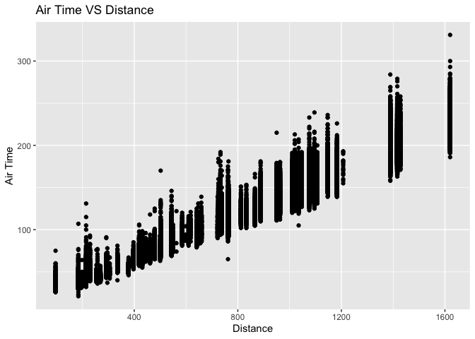
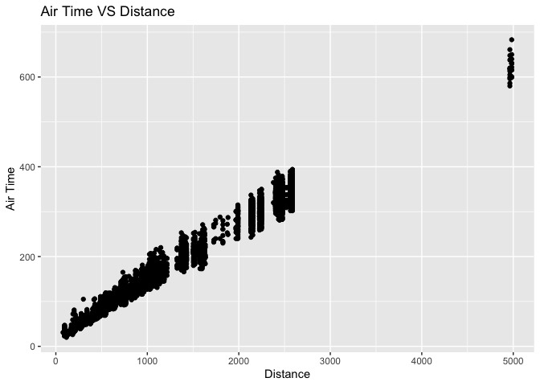
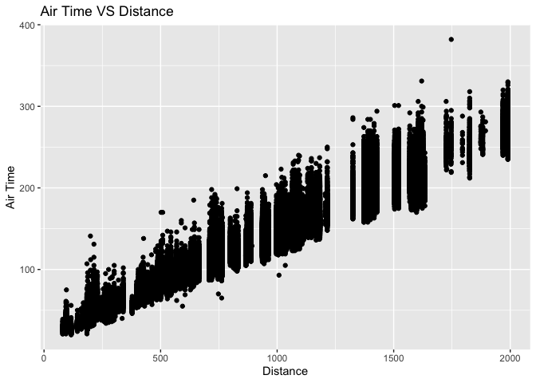
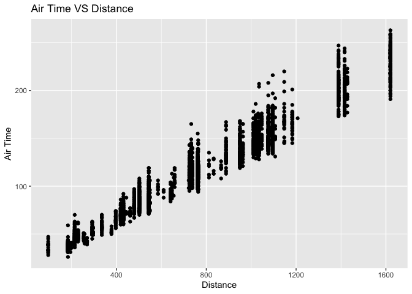
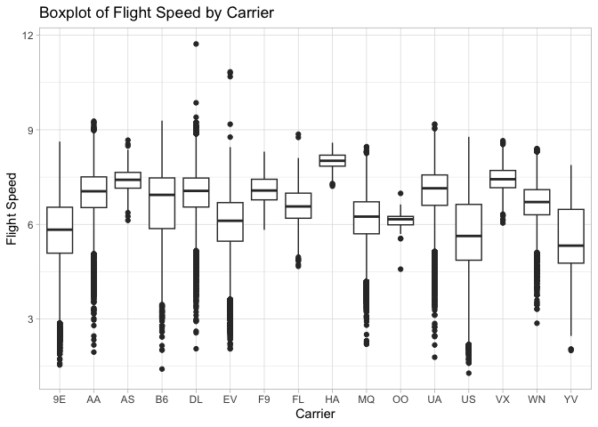
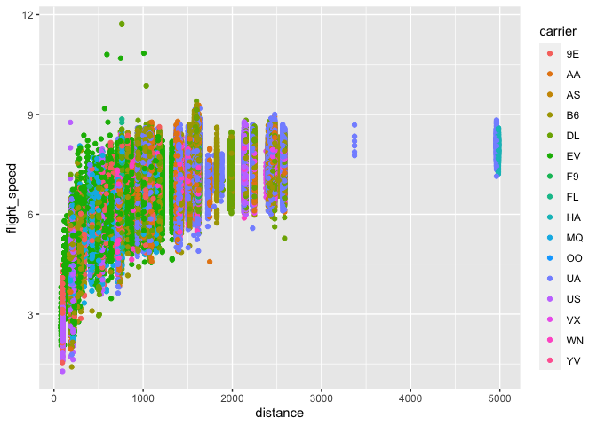
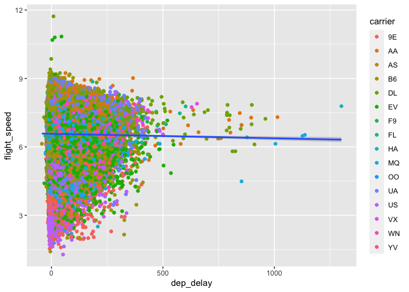

Hmk_04: Data frames and data wrangling
================

Please read the entire [R for Data
Science](https://r4ds.hadley.nz/data-transform) before you do this
homework.

This homework relies on the `nycflights13` package, which contains
several data frames, including `airlines`, `airports`, `flights`,
`planes`, and `weather`. Loading `nycflights13`
(`library(nycflights13)`) puts all of these data frames on the search
path.

## Installing data packages

Remember that any package needs to be installed only once (per version
of R), but needs to be loaded every time we start a new R session.

To install `nyclflights13`, use `install.packages("nycflights13")` (with
quotation marks). To load it, use `library(nycflights13)`.

``` r
# install.packages('nycflights13')
# install.packages("tidyverse")
library(tidyverse)
```

    ── Attaching core tidyverse packages ──────────────────────── tidyverse 2.0.0 ──
    ✔ dplyr     1.1.2     ✔ readr     2.1.4
    ✔ forcats   1.0.0     ✔ stringr   1.5.0
    ✔ ggplot2   3.4.2     ✔ tibble    3.2.1
    ✔ lubridate 1.9.2     ✔ tidyr     1.3.0
    ✔ purrr     1.0.1     
    ── Conflicts ────────────────────────────────────────── tidyverse_conflicts() ──
    ✖ dplyr::filter() masks stats::filter()
    ✖ dplyr::lag()    masks stats::lag()
    ℹ Use the conflicted package (<http://conflicted.r-lib.org/>) to force all conflicts to become errors

``` r
library(nycflights13)
glimpse(flights)
```

    Rows: 336,776
    Columns: 19
    $ year           <int> 2013, 2013, 2013, 2013, 2013, 2013, 2013, 2013, 2013, 2…
    $ month          <int> 1, 1, 1, 1, 1, 1, 1, 1, 1, 1, 1, 1, 1, 1, 1, 1, 1, 1, 1…
    $ day            <int> 1, 1, 1, 1, 1, 1, 1, 1, 1, 1, 1, 1, 1, 1, 1, 1, 1, 1, 1…
    $ dep_time       <int> 517, 533, 542, 544, 554, 554, 555, 557, 557, 558, 558, …
    $ sched_dep_time <int> 515, 529, 540, 545, 600, 558, 600, 600, 600, 600, 600, …
    $ dep_delay      <dbl> 2, 4, 2, -1, -6, -4, -5, -3, -3, -2, -2, -2, -2, -2, -1…
    $ arr_time       <int> 830, 850, 923, 1004, 812, 740, 913, 709, 838, 753, 849,…
    $ sched_arr_time <int> 819, 830, 850, 1022, 837, 728, 854, 723, 846, 745, 851,…
    $ arr_delay      <dbl> 11, 20, 33, -18, -25, 12, 19, -14, -8, 8, -2, -3, 7, -1…
    $ carrier        <chr> "UA", "UA", "AA", "B6", "DL", "UA", "B6", "EV", "B6", "…
    $ flight         <int> 1545, 1714, 1141, 725, 461, 1696, 507, 5708, 79, 301, 4…
    $ tailnum        <chr> "N14228", "N24211", "N619AA", "N804JB", "N668DN", "N394…
    $ origin         <chr> "EWR", "LGA", "JFK", "JFK", "LGA", "EWR", "EWR", "LGA",…
    $ dest           <chr> "IAH", "IAH", "MIA", "BQN", "ATL", "ORD", "FLL", "IAD",…
    $ air_time       <dbl> 227, 227, 160, 183, 116, 150, 158, 53, 140, 138, 149, 1…
    $ distance       <dbl> 1400, 1416, 1089, 1576, 762, 719, 1065, 229, 944, 733, …
    $ hour           <dbl> 5, 5, 5, 5, 6, 5, 6, 6, 6, 6, 6, 6, 6, 6, 6, 5, 6, 6, 6…
    $ minute         <dbl> 15, 29, 40, 45, 0, 58, 0, 0, 0, 0, 0, 0, 0, 0, 0, 59, 0…
    $ time_hour      <dttm> 2013-01-01 05:00:00, 2013-01-01 05:00:00, 2013-01-01 0…

# Question 1: filtering

Make a plot of air time as a function of distance (air time on the y
axis, distance on the x axis) for all flights that meet the following
criteria:

``` r
# we can first remove NA here but i chose to NOT do that at first
# clean_flights = na.omit(flights)
```

- originate from LaGuardia airport (“LGA”)

  ``` r
  # filter all rows with LGA as origin
  # why i used select first and than removed NA --> because i just want to remove rows without the distance or air_time data, and other NA in other properties can stay
  originate_LGA = filter(flights, origin == 'LGA') |> select(distance, air_time) |> na.omit()
  # glimpse(originate_LGA)
  # plotting
  ggplot(originate_LGA, aes(x = distance, y = air_time)) +
    geom_point() +
    labs(x = "Distance", y = "Air Time") +
    ggtitle("Air Time VS Distance")
  ```

  

- departed on the 16th of the month

  ``` r
  depart_on_D16 = filter(flights, day == 16) |> select(distance, air_time) |> na.omit()
  # glimpse(depart_on_D16)
  # plotting
  ggplot(depart_on_D16, aes(x = distance, y = air_time)) +
    geom_point() +
    labs(x = "Distance", y = "Air Time") +
    ggtitle("Air Time VS Distance")
  ```

  

- have a flight distance of less than 2000

  ``` r
  distance_less_than_2000 = filter(flights, distance <= 2000) |> select(distance, air_time) |> na.omit()
  # glimpse(distance_less_than_2000)
  # plotting
  ggplot(distance_less_than_2000, aes(x = distance, y = air_time)) +
    geom_point() +
    labs(x = "Distance", y = "Air Time") +
    ggtitle("Air Time VS Distance")
  ```

  

## now Let’s plot using all the criteria above together

``` r
# all the criteria above together

all_criteria = flights |> filter(origin == 'LGA') |> filter(day == 16) |> filter(distance <= 2000) |> select(distance, air_time) |> na.omit()
# glimpse(all_criteria)
# plotting
ggplot(all_criteria, aes(x = distance, y = air_time)) +
  geom_point() +
  labs(x = "Distance", y = "Air Time") +
  ggtitle("Air Time VS Distance")
```



# Question 2: dealing with NAs

Make a data frame of all of the rows of `flights` that have values for
*both* `arr_time` and `dep_time` - that is, neither of those values are
`NA`.

``` r
#remove rows with NA in specific columnr
clean_flights <- flights[complete.cases(flights[ , c('distance', 'air_time')]), ] 
glimpse(clean_flights)
```

    Rows: 327,346
    Columns: 19
    $ year           <int> 2013, 2013, 2013, 2013, 2013, 2013, 2013, 2013, 2013, 2…
    $ month          <int> 1, 1, 1, 1, 1, 1, 1, 1, 1, 1, 1, 1, 1, 1, 1, 1, 1, 1, 1…
    $ day            <int> 1, 1, 1, 1, 1, 1, 1, 1, 1, 1, 1, 1, 1, 1, 1, 1, 1, 1, 1…
    $ dep_time       <int> 517, 533, 542, 544, 554, 554, 555, 557, 557, 558, 558, …
    $ sched_dep_time <int> 515, 529, 540, 545, 600, 558, 600, 600, 600, 600, 600, …
    $ dep_delay      <dbl> 2, 4, 2, -1, -6, -4, -5, -3, -3, -2, -2, -2, -2, -2, -1…
    $ arr_time       <int> 830, 850, 923, 1004, 812, 740, 913, 709, 838, 753, 849,…
    $ sched_arr_time <int> 819, 830, 850, 1022, 837, 728, 854, 723, 846, 745, 851,…
    $ arr_delay      <dbl> 11, 20, 33, -18, -25, 12, 19, -14, -8, 8, -2, -3, 7, -1…
    $ carrier        <chr> "UA", "UA", "AA", "B6", "DL", "UA", "B6", "EV", "B6", "…
    $ flight         <int> 1545, 1714, 1141, 725, 461, 1696, 507, 5708, 79, 301, 4…
    $ tailnum        <chr> "N14228", "N24211", "N619AA", "N804JB", "N668DN", "N394…
    $ origin         <chr> "EWR", "LGA", "JFK", "JFK", "LGA", "EWR", "EWR", "LGA",…
    $ dest           <chr> "IAH", "IAH", "MIA", "BQN", "ATL", "ORD", "FLL", "IAD",…
    $ air_time       <dbl> 227, 227, 160, 183, 116, 150, 158, 53, 140, 138, 149, 1…
    $ distance       <dbl> 1400, 1416, 1089, 1576, 762, 719, 1065, 229, 944, 733, …
    $ hour           <dbl> 5, 5, 5, 5, 6, 5, 6, 6, 6, 6, 6, 6, 6, 6, 6, 5, 6, 6, 6…
    $ minute         <dbl> 15, 29, 40, 45, 0, 58, 0, 0, 0, 0, 0, 0, 0, 0, 0, 59, 0…
    $ time_hour      <dttm> 2013-01-01 05:00:00, 2013-01-01 05:00:00, 2013-01-01 0…

## filtering NAs

`ggplot()` will automatically remove NA values from the plot, as you may
have seen in question 1, but it emits a warning message about that. Of
course you could silence the warning message using [chunk
options](https://bookdown.org/yihui/rmarkdown-cookbook/chunk-options.html),
but how could you prevent them from appearing in the first place?

> the \`echo = FALSE\` parameter can be added to the code chunk to
> prevent printing the R code that generated the plots and so on.
>
> {r, error = FALSE} also can be added to hide errors

# Question 3: adding columns

Create a data frame of average flight speeds, based on `air_time` and
`distance`. Make either a histogram or a density plot of the data. If
you like, you may break the data out (e.g. by airline, or some other
variable) in a way that you think makes sense.

### answer:

since SI is my choice for speed unit, we need to convert units using
mutate.

> **Meters per second (m/s)**: This is the SI (International System of
> Units) unit for speed.

``` r
# if you want km/min as speed unit
new_dataframe_1 = clean_flights |> mutate(flight_speed = distance / air_time)

# convert it to m/s
new_dataframe_2 = new_dataframe_1 |> mutate(flight_speed = (flight_speed /60)*1000)

# American units MPH
new_dataframe_3 = new_dataframe_1 |> mutate(flight_speed = (flight_speed * 2.23694))
                                            
# Airspeed is usually measured in knots nautical miles per hour
new_dataframe_4 = new_dataframe_1 |> mutate(flight_speed = (flight_speed * 1.94384))
```

depend on question we can make different groups, for example, which
airline has a higher speed airplanes.

``` r
carrier_vs_speed = new_dataframe_1 |> group_by(carrier) |> summarise(average_flight_speed = mean(flight_speed))
# glimpse(carrier_vs_speed)

# plotting
ggplot(new_dataframe_1, aes(x = carrier, y = flight_speed)) +
  geom_boxplot() +
  labs(x = "Carrier", y = "Flight Speed") +
  ggtitle("Boxplot of Flight Speed by Carrier")+
  theme_light()
```



why i made this plot?

to test that if we have long trips, do pilots increase their speed
limit?

``` r
ggplot(data = new_dataframe_1, aes(x = distance, y = flight_speed)) + 
    geom_point(aes(colour = carrier))
```



let’s test this hypothesis

if there is a delay in flight, the plane driver will drive faster?

answer:  
No, if there is a delay in a flight, the pilot does not drive the plane
faster. In fact, pilots do not “drive” planes; they fly them. :)

Airplanes have specific speed limits and performance parameters that
must be adhered to for safety, and pilots are trained to operate within
these limits.

``` r
glimpse(new_dataframe_1)
```

    Rows: 327,346
    Columns: 20
    $ year           <int> 2013, 2013, 2013, 2013, 2013, 2013, 2013, 2013, 2013, 2…
    $ month          <int> 1, 1, 1, 1, 1, 1, 1, 1, 1, 1, 1, 1, 1, 1, 1, 1, 1, 1, 1…
    $ day            <int> 1, 1, 1, 1, 1, 1, 1, 1, 1, 1, 1, 1, 1, 1, 1, 1, 1, 1, 1…
    $ dep_time       <int> 517, 533, 542, 544, 554, 554, 555, 557, 557, 558, 558, …
    $ sched_dep_time <int> 515, 529, 540, 545, 600, 558, 600, 600, 600, 600, 600, …
    $ dep_delay      <dbl> 2, 4, 2, -1, -6, -4, -5, -3, -3, -2, -2, -2, -2, -2, -1…
    $ arr_time       <int> 830, 850, 923, 1004, 812, 740, 913, 709, 838, 753, 849,…
    $ sched_arr_time <int> 819, 830, 850, 1022, 837, 728, 854, 723, 846, 745, 851,…
    $ arr_delay      <dbl> 11, 20, 33, -18, -25, 12, 19, -14, -8, 8, -2, -3, 7, -1…
    $ carrier        <chr> "UA", "UA", "AA", "B6", "DL", "UA", "B6", "EV", "B6", "…
    $ flight         <int> 1545, 1714, 1141, 725, 461, 1696, 507, 5708, 79, 301, 4…
    $ tailnum        <chr> "N14228", "N24211", "N619AA", "N804JB", "N668DN", "N394…
    $ origin         <chr> "EWR", "LGA", "JFK", "JFK", "LGA", "EWR", "EWR", "LGA",…
    $ dest           <chr> "IAH", "IAH", "MIA", "BQN", "ATL", "ORD", "FLL", "IAD",…
    $ air_time       <dbl> 227, 227, 160, 183, 116, 150, 158, 53, 140, 138, 149, 1…
    $ distance       <dbl> 1400, 1416, 1089, 1576, 762, 719, 1065, 229, 944, 733, …
    $ hour           <dbl> 5, 5, 5, 5, 6, 5, 6, 6, 6, 6, 6, 6, 6, 6, 6, 5, 6, 6, 6…
    $ minute         <dbl> 15, 29, 40, 45, 0, 58, 0, 0, 0, 0, 0, 0, 0, 0, 0, 59, 0…
    $ time_hour      <dttm> 2013-01-01 05:00:00, 2013-01-01 05:00:00, 2013-01-01 0…
    $ flight_speed   <dbl> 6.167401, 6.237885, 6.806250, 8.612022, 6.568966, 4.793…

``` r
ggplot(data = new_dataframe_1, aes(x = dep_delay, y = flight_speed)) + 
    geom_point(aes(colour = carrier))+
    geom_smooth(method = lm)
```

    `geom_smooth()` using formula = 'y ~ x'


