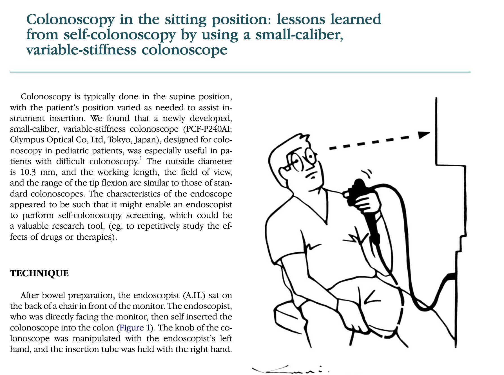
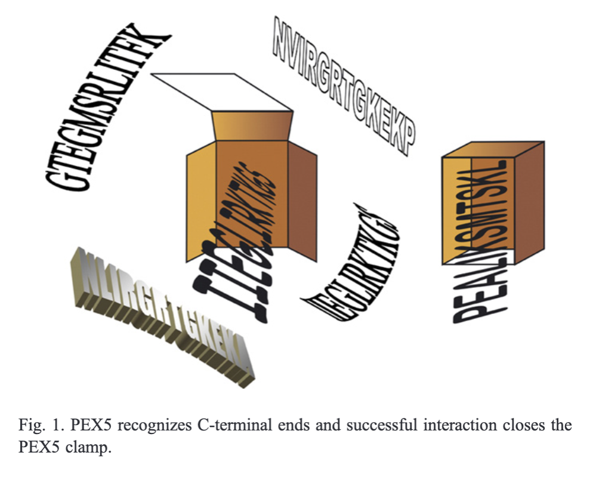
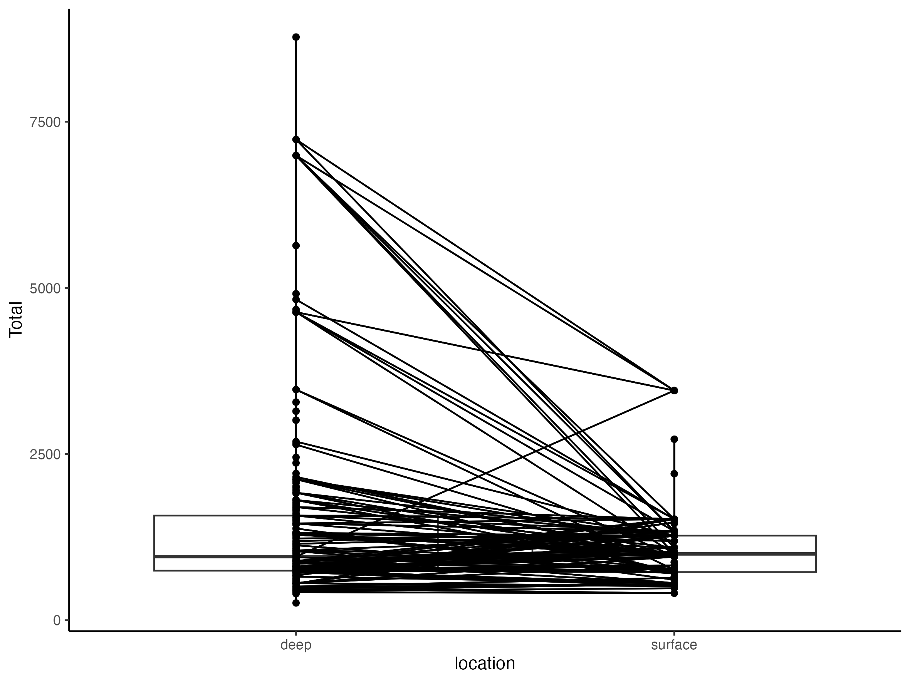
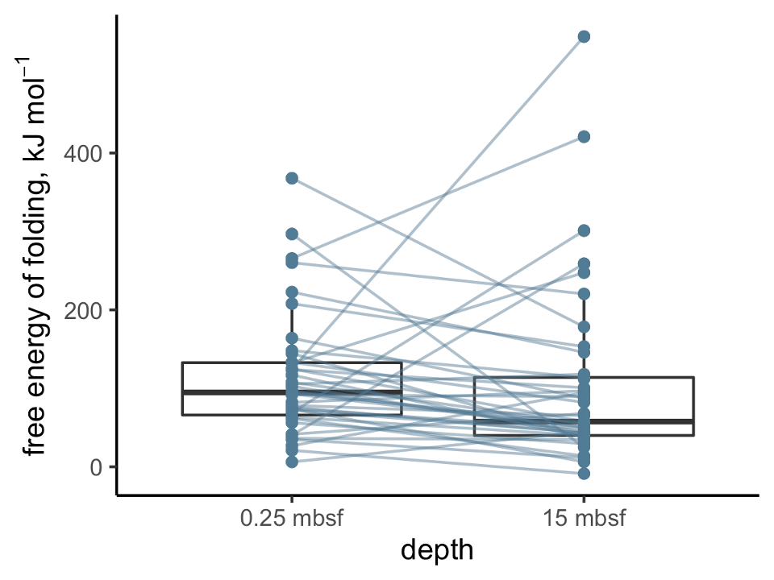

#### what is wrong with this figure?
1. Words have the occasional ability to outperform plots
below is my own bad plot
- > what should have been done?

---
#### What should have been done?

---

#### plots from my own project

- > what should have been done?

- > what should have been done?