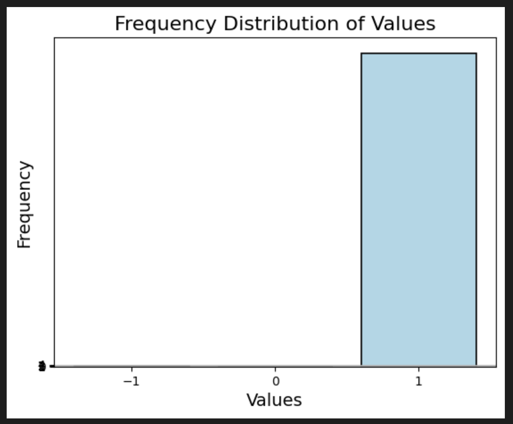
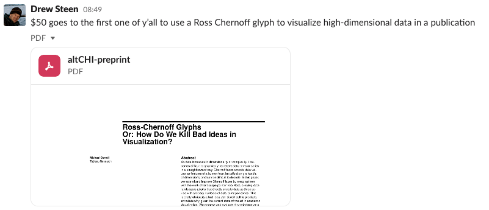
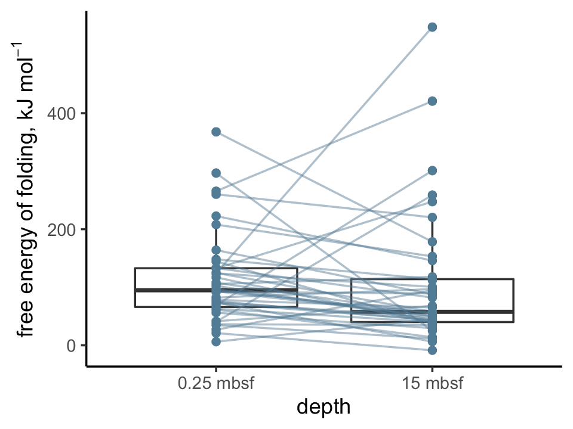

# good plot 1

1. Words have the occasional ability to outperform plots

## below is my own bad plot

---

#### What's wrong with this one?
Without a doubt, it's difficult to display multiple curves simultaneously and ensure that the individual curves may be seen. Colors would be nice, but if color is not allowed, four different line types (solid, dashed, dotted, dash-dotted) might work.

---

## what is Chernoff face?
Chernoff faces encode data values as features of a human face, but afford only a handful of dimensions, and can be difficult to decode.

---

# good plot

---
---

# to much Data

---

# 3D is not always good

