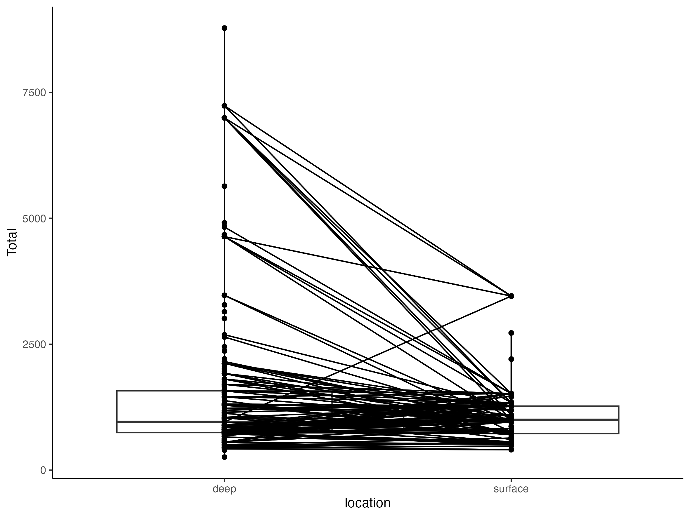

![[bad_plot/1234.png]]

1. Words have the occasional ability to outperform plots
below is my own bad plot

![[bad_plot/12345.png]]
---

#### What's wrong with this one?
Without a doubt, it's difficult to display multiple curves simultaneously and ensure that the individual curves may be seen. Colors would be nice, but if color is not allowed, four different line types (solid, dashed, dotted, dash-dotted) might work.

---

---
#### What should have been done?
Figure 1D could have been discarded completely, and the whole figure shouldn't take up more than half a page.

![[outpu1t.png]]
![[output.png]]![[altCHI-preprint.pdf]]

to much Data

3D is not always good

And this one made us chuckle. The smallest slice is 56%. And, er, 56% and 42% add up to 98%.

